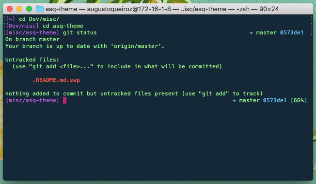

# asq theme

Theme based on [theunraveler](https://github.com/robbyrussell/oh-my-zsh/wiki/Themes#theunraveler)



*Color scheme used: [Cobalt Neon](https://github.com/lysyi3m/osx-terminal-themes#cobalt-neon)*

## Installation

Follow the [oh-my-zsh instructions](https://github.com/robbyrussell/oh-my-zsh/wiki/Customization#overriding-and-adding-themes) or run the following:
```
    $ mkdir -p $ZSH_CUSTOM/themes && curl https://raw.githubusercontent.com/AugustoQueiroz/asq-theme/master/asq.zsh-theme -L -o $ZSH_CUSTOM/themes/asq.zsh-theme
```
Then enable the battery plugin in your **.zshrc** file - if this pluggin isn't enabled, an annoying error will keep poping up.

```
plugins=(
    ...
    battery
    ...
)
```

Finally, set the theme in you **.zshrc** file

```
ZSH_THEME="asq"
```
